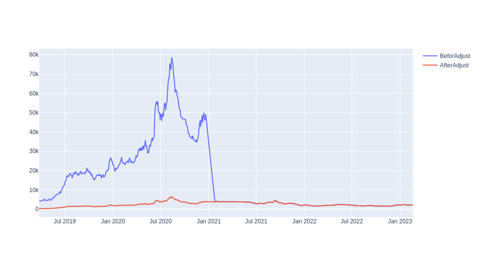

## Table of contents
* [Price Adjustment](#Price-Adjustment)
* [Code](#Code)

## Price Adjustment
 An important issue in Iran Stock Exchange is adjustment of stock prices after capital raising through equity. There are different types of capital raising through equity, and sometimes you need to adjust the prices after it. In the following, I use an easy approach and provide corresponding Python code to get and adjust prices with respect to all capital raising. In fact, we want to calculate the adjusted price of a stock in any arbitrary interval with respect to the end of this interval. Consider the following two vector
 ```math
 P = (P_1,P_2,\cdots,P_n) \\
 P^{y} = (P_1^{y},P_2^{y},\cdots,P_n^{y}).
 ```

 
 Where $P_i$ is the price of day ($i$)  and $P_i^{y}$ is the price of day ($i-1$).Infact, index $y$ refer to yesterday and $P_i^{y}$ is the price of day ($i-1$) that calculate in day $i$, i.e., if there have been changes such as dividend distribution between day ($i-1$) and day $i$, we will apply its effect on price of day ($i-1$). Let us give an example: consider $P_{i-1} = k$ and $Dividend = d$, then $P_i^{y} = k-d$. Now we can calculate the adjusted price with respect to all capital raise till the end of the interval using the following formula
 ```math
 P_i^{Adj}=P_n\prod_{k=i+1}^{n}\frac{P_i^{y}}{P_i}
 ```
## Code
This code is created of the following steps:
* calling Tehran stock exchange and Iran faraboure data from the web using package [pytse-client](https://pypi.org/project/pytse-client/) ...
```python
import numpy as np
import pandas as pd
import pytse_client as tse
tickers = tse.download(symbols="all", write_to_csv=True,  include_jdate=True)
Price = tickers["قشکر"]
```

* We want to adjust the price from the 1396-01-01 till the 1401-12-01 with respect to all capital injections that occurred in this interval.
```python
import jdatetime
from datetime import datetime
FirstDayOfInterval = '1398-01-01'
LastDayOfInterval = '1401-12-01'

gregorian_date = jdatetime.date(int(LastDayOfInterval[0:4]),
                                int(LastDayOfInterval[5:7]),int(LastDayOfInterval[8:10])).togregorian()
Fgregorian_date = jdatetime.date(int(FirstDayOfInterval[0:4]),
                                 int(FirstDayOfInterval[5:7]),int(FirstDayOfInterval[8:10])).togregorian()

def DateT(a):
    return(datetime.fromisoformat((a)))
Price['date'] = Price['date'].apply(lambda x: DateT(x))
PriceFilter = Price[(Price['date'] > pd.Timestamp(pd.to_datetime(Fgregorian_date))) & (Price['date'] < pd.Timestamp(pd.to_datetime(gregorian_date)))]
```
* And finally, by the following code, we can adjust the close prices
```python
Ratio =  PriceFilter['adjClose']/ PriceFilter['yesterday']
CumProd = Ratio.cumprod()
Prod = Ratio.prod()
AdjusetCumProd = CumProd/Prod
Loc = PriceFilter.columns.get_loc('adjClose')
a = PriceFilter.iloc[-1, Loc]*AdjusetCumProd
PriceFilter.insert(Loc+1,"AdjustedPrice", a, True)
PriceFilter

```
```python
import plotly.express as px 
import plotly.graph_objects as go
from plotly.subplots import make_subplots
fig = go.Figure()
fig.add_trace(go.Scatter(x=PriceFilter['date'], y=PriceFilter['adjClose'],name="BeforAdjust"))
fig.add_trace(go.Scatter(x=PriceFilter['date'], y=PriceFilter['AdjustedPrice'], name="AfterAdjust"))
```

